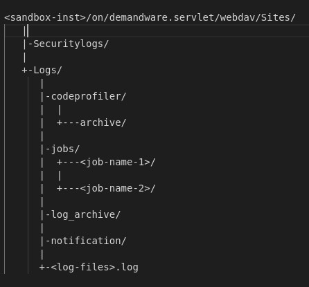

# SFCC Log Files Analysis

Presenter: Appan

Date: 28 Feb, 2022

## Motivation

* Production defects - hard to reproduce
    - Only Log files
    - Only WARN level & above log records
* Developer Sandboxes - Code bugs
    - How many developers look at logs ?
* Developer IDE integration - not good
* LogCenter 
    - Separate application
    - Requires access from Account Manager

##^ Agenda

* Webdav Logs Folder & Files
    * Log Types & File Naming Convention
    * Log Files Retention & Other Limits
    * Log Record Structure
* Other Log Files
* Root-Cause Analysis: Scenarios
* Demo - Setup, Filter & Merge Script
* Resources & What Next ?

## Webdav Logs Folder Structure

<div class="twocolumn">

<div id="left">



</div>

<div id="right" data-markdown>

* `Logs/` - both sub-directories & log files
* `log_archive/` - older log files in gzip format
* `jobs/<specific-job>/` - job specific 
* `codeprofiler/` - CSV files of the profiler runtime data
* `SecurityLogs/` - security specific log files
* `notification/` - bucket text files
</div>
</div>

##^ Log Types & File Naming Convention

* Log File Name: `<log-type>-[<categ>]-ecom-<inst-type>-<inst>-app-<blade-id>-appserver-<date>.log[.gz]`
* `log-type`: 
    - custom, `custom<level>`, `<level>`, security, service
    - api, jobs, migration, quota, sysevent, syslog
* `categ`: Log category from code or service name

```
customwarn-ecom-sandbox-bcmp-001-app-7c56fb8dd5-rbc8d-0-appserver-20220225.log
custom-OrderHistory-ecom-sandbox-bchc-001-app-79df4fdc5f-5576n-0-appserver-20220222.log
error-ecom-sandbox-bchc-001-app-79df4fdc5f-5576n-0-appserver-20220222.log
security-ecom-sandbox-bclk-033-app-589dcc49dc-lwxqx-0-appserver-20211123.log
service-curlec-ecom-sandbox-bchc-001-app-79df4fdc5f-5576n-0-appserver-20220222.log
jobs-ecom-sandbox-bchc-001-app-79df4fdc5f-5576n-0-appserver-20220222.log
notification/unbucketed-marykayintouch-ph.txt
report-ecom-sandbox-bchc-001-app-79df4fdc5f-zsw5n-0-appserver-20220225-142104.csv
```

##^ Log Files Retention & Other Limits

* Top-level `Logs` folder: 
    - Latest log files
    - After *3 days*, the log files are moved into a `log_archive/`
    - `.last_cleanup` file updated with timestamp after a cleanup
* Per folder limit: *100,000 files*
    - Do not have too many levels of log category
* Only *30 days* worth of logs
* Security logs - *90 days* retention

##^ Retention: Special Log Entries

* Daily log file limit: *100 MB*
    - In PROD - never let this happen even in high load
* Maximum log file size limit has reached
* Repeat log records ignored log entry

```
[2022-02-24 03:43:51.007 GMT] ERROR RepeatedMessageSuppressingFilter-Thread custom.checkout []
  The following message was generated more than 10 times within the last 180 seconds. 
  It will be suppressed for 180 seconds: Customer No: 05A67C57-E1C3-4D8F-B1E8-5204F5C02892 
[2022-02-24 08:08:37.389 GMT] INFO ShopAPIServlet|1060473459|/servlet/s/marykayintouch-global1
  /dw/shop/v19_8/baskets/ba531be6c867fbbf68481032f4 custom.checkout [] 
[1970-01-01 00:00:00.000 GMT] WARN null null []  +++++++++++ Maximum log file size per day reached,
 logging suspended until tomorrow. +++++++++++
```


##^ Log Record Structure

```
[2022-02-24 03:44:03.859 GMT] INFO PipelineCallServlet|1790199935|Sites-marykayintouch-global1-Site|
  Cart-Show|PipelineCall|GzLA3dK_wu custom.checkout []
  Customer No: 05A67C57-E1C3-4D8F-B1E8-5204F5C02892 Subsidiary Code: DE . Attribute ID: orderCost = 22.3. taxAmt = 0, total = 22.3

[2022-02-24 00:23:10.022 GMT] ERROR ShopAPIServlet|1868046048|/servlet/s/marykayintouch-global1/dw/shop/v19_8/baskets 
custom.checkout []  Customer No: 99999992 Subsidiary Code: DE . There is no configured TaxCode config for Tax Code: null

[2022-02-25 13:45:43.050 GMT] WARN PipelineCallServlet|1596223442|Sites-marykayintouch-cz-Site|
  CSR-OrderSearchAJAX|OnRequest|TDknpclhOG custom.dw.system.Cache []  
  Cache entry for key 'marykayintouch-czPromotionQualifiers' is too large. The object will not be stored in the cache.

[2022-02-24 00:22:14.080 GMT] ERROR SystemJobThread|543399044|sfcc-site-archive-import|ImportSiteArchive 
  com.demandware.beehive.orm.capi.common.ORMObject Sites-Site JOB b0c81b02e1 b47a8d275e963cc7c889899453 
  7013248287514587136 - String value truncated for 

[2022-02-24 04:00:23.799 GMT] ERROR PipelineCallServlet|1108707729|Sites-marykayintouch-global1-Site|Order-Confirm|PipelineCall|GzLA3dK_wu
 org.apache.jsp.isml2jsp.cartridges.org_005fmarykayintouch.default_.account.order.details.productCard_002d1_002d388a568cf4f995cb7aac79503a2f5cbba8860d5a_jsp Sites-marykayintouch-global1-Site STOREFRONT GzLA3dK_wu 
 TgFZZdYCF2KY-DMK-0-00 2395808312415949824 - Error in template script.

[2022-02-24 10:13:08.350 GMT] ERROR PipelineCallServlet|580948734|Sites-marykayintouch-global1-Site|Cart-AddProduct|PipelineCall|1vf7O_Nn_r
 system.core Sites-marykayintouch-global1-Site STOREFRONT 1vf7O_Nn_r TgE17TJaF2KY-DMK-0-00 7796008893045012480 - Exception occurred during
  request processing: ScriptingException Wrapped com.demandware.beehive.orm.capi.common.ORMDoesntExistException: Custom attribute cannot be
  written to deleted object [BasketProductLineItemPO, com.demandware.beehive.core.capi.domain.PersistentObjectPOKey
  (com.demandware.beehive.bts.internal.orderprocess.basket.BasketProductLineItemPO) [7c48f033f22a233ec177a8493f]] 
  (org_marykayintouch/cartridge/scripts/cart/cartHelpers.js#438)
```

## Security & Code Profiler Log

<div id='left' data-markdown>

* Security logs:
    - Business manager ACL actions
    - Business Manager Pipeline
    - Login & Logout actions - `[DW-SEC]`
    - User role assignments & removals
    - CSRF token related

</div>
<div id="right" data-markdown>

* Code Profiler Logs:
    - Generated every one-hour
    - Controller run-times: 
       * Count, Total Time, OwnTime
       * Total wait-time, Own wait-time
    - Types: 
       * ISML, ON_REQUEST, SF_PAGE,
       * PIPELINE_NODE, SCRIPT_CONTROLLER
       * REST_DATA,SCRIPT_HOOK,SCRIPT_API

</div>

## Root-Cause Analysis (RCA)

* Needs a "investigative" / "hacker" mindset
* Low Difficulty - single log entry is sufficient
* Medium Difficulty - more contextual info from other files
* High Difficulty - correlate multiple sources
    - Using code profiler logs
    - Site meta-data & data/config files
* No relevant logs or missing logs entries

##^ RCA - Checkout Problem - Customer ID

* Useful for checkout related issues
    - Assuming we know the customer or order ID
    - Assuming we know approximate time & date
* Get Customer UUID from BM Customer Detail Page
* Customer UUID in platform error-*.log file
* Filter log records with the session ID & merge-sort 
```
RequestID: TgEBR-XPFmKY-DMK-0-00
SessionType: STOREFRONT
Truncated SessionID: QXhTbkEEc2
Customer UUID: ab5e1A0up0d805KIHXrZG0TcRf
```

```
[2022-02-24 00:23:08.096 GMT] ERROR PipelineCallServlet|1713105395|Sites-marykayintouch-global1-Site|
Tester-Run|PipelineCall|yDZhhhKc7d system.core Sites-marykayintouch-global1-Site STOREFRONT
```

##^ Demo of the Filter & Merge Script

* Install `rclone` binary file
* Setup `.config/rclone/rclone.conf` for each instance
    - `rclone config` interactive command
* Use `rclone copy` to download the log files using webdav
* Run the filer & merge script using the command:
  `scripts/get_sorted_logs_for_customer_n_date.sh ~/marykay_consult/bcmp-001_logs/ sess:O2-WQj5sHZ 20220225`

### Best Practices & Resources

1. Proper choice of log levels & category
    * Using DEBUG instead of INFO
    * Use WARN instead of INFO (required for PROD)
    * Do not use root logger
    * Create log category - upto 3 levels
    * Use FATAL log entry when required
1. Use log analysis & notification (PROD logs)
    * ELK stack with custom extensions
1. SFCC Documentation [Log Files](https://documentation.b2c.commercecloud.salesforce.com/DOC1/topic/com.demandware.dochelp/content/b2c_commerce/topics/site_development/b2c_log_files_overview.html)
1. `rclone` [download link](https://rclone.org/downloads/)

### What Next ?

* Enhancements to filter & merge script
    - Using customer uuid as input
    - Enable / Disable job logs
* DevOps & Log Analysis
    - Finding new log entries compared to previous release
* VS-Code / neovim Integration
    - Browse new log entries while testing
    - Try to fill-in missing info from logs

### Ignorance Level from Log Files !!

TODO

 